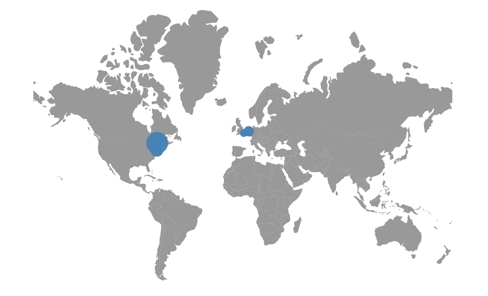

# Twitter Live Data Visualization

## Live Hosts

The project is hosted on http://karanagarwal.me/live-worldmap-visualization .

## Description

The Twitter Live Data Visualization project utilized the power of Data Visualizations to create a world-map and uses the Twitter Streaming API to fetch tweets with their location.

It then plots the tweets on the map according to their co-ordinates and the number of followers the user has.

Corresponding to every data a circle is plotted on the map whose location depends on the co-ordinates of the tweet and the radius is a function of the number of followers.

## Technologies Used

* Node.Js - for server side programming.
* D3.Js - for Data Visualization.
* Twitter Stream API - for getting the tweet data in real-time.
* Heroku - for deploying the back-end of the webapp.
* Socket.io - for sending the tweet data to the client-side.
